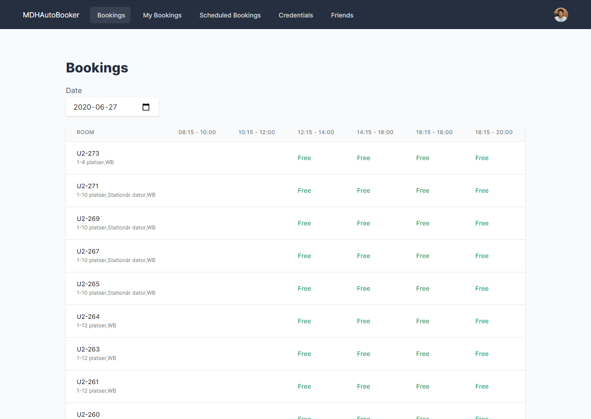

<h1 align="center">
  MDHAutoBooker
</h1>

<p align="center">
    
</p>

<p align="center">
  Auto booker for MDH Kronox Västerås, originally made by <a href="https://github.com/Roslund/GroupRoomMaffia/">Roslund</a>
</p>



## Getting started

### Launch the project

*(Assuming you've [installed Laravel](https://laravel.com/docs/installation))*


``` bash
git clone https://www.github.com/ATholin/MDHAutoBooker.git
cd MDHAutoBooker
composer install
```

Next you need to make a copy of the `.env.example` file and rename it to `.env` inside your project root.

``` bash
cp .env.example .env
```

Generate application key

```
php artisan key:generate
```

Start development server

```
php artisan serve
```

## Testing

``` bash
composer test
```

## License

The MIT License (MIT). Please see [License File](LICENSE) for more information.
